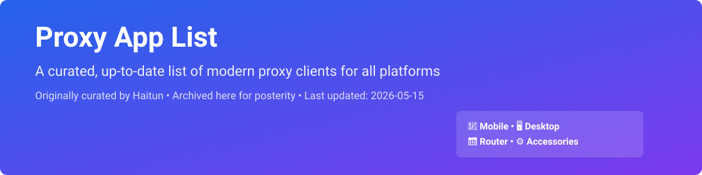

# Proxy App List

<picture>
  <source media="(prefers-color-scheme: dark)" srcset="assets/readme/hero-dark.svg">
  
</picture>

> A curated, up-to-date list of proxy clients for all platforms.  
> Originally curated by [Haitun](https://www.haitunt.org/app.html), archived here for posterity.

## 📋 Overview

This repository is an archival mirror of the popular proxy client recommendation list maintained at [haitunt.org](https://www.haitunt.org/app.html).

It aims to be a **"keep up with the times"** collection that covers:
- Mobile devices (Android/iOS/HarmonyOS/SteamOS)
- Desktop systems (Windows/macOS/Linux/FreeBSD)
- Routers (ASUS/小米/OpenWrt)
- Accessories (rulesets/tools/subscription converters)

**Last updated:** `2026-05-15`

## 📚 Proxy Priority Roadmap

Recommendations are grouped by usage scenario to help you choose quickly:

### Basic Needs

> For "on-the-go + single device" scenarios — choose by your device/OS.

### Sweet Spot Needs

> For "fixed location + long-time running + ≥2 devices" — willing to spend an afternoon researching, and believe: **usability > ultimate performance**

| Recommendation | Price | Rating | Notes |
|----------------|-------|--------|-------|
| [ASUS Router with custom firmware](#asus) | ¥400 ~ 2000 | ⭐⭐⭐ | Best balance of functionality × usability × budget |
| [Mac Mini as bypass gateway](#macrouter) | ¥3000 | ⭐⭐☆ | Close performance to ASUS, but more expensive with diminishing returns |
| [Xiaomi/Redmi Router](#xiaomi) | ¥120 ~ 1000 | ⭐⭐ | Great value for money, requires unlock SSH |
| [Apple TV (wired)](#ios) | ¥1000 | ⭐ | Non-mainstream option, not recommended unless you just happen to have one |

> **Note:** ★★ and above are enough to cover 90% of users.

### Advanced Needs

> For those who pursue more extreme, customized experience:

- **Long-distance single-thread ≥ 1000Mbps** — Requires [TCP tuning](https://t.me/haitun_channel/840) unless you are in very few cities like Wuhan/Hefei
- **Dual极致 latency domestic + overseas** — Hard to get both best even with fake-ip, Sing-box core or [爱快/ROS "pseudo-multi-w拨 loopback splitting"](https://www.youtube.com/watch?v=3B1MSVF43o4) needed
- **Extreme performance regardless of deployment difficulty** — Go all out if you want it

## 📱 Mobile Devices

### 🤖 Android

#### Tier 1

>
- [**Exclave**](https://github.com/dyhkwong/Exclave)  
  Stand-alone single-node configuration based on v2ray core. Stable, simple to use, chain proxy easy to operate.  
  🟢 New protocols/features are followed up quickly, **best protocol coverage across all platforms**. Branching is cumbersome; Material Design classic UI.

- [**FlClash**](https://github.com/chen08209/FlClash)  
  Full protocol support,分流, relatively power efficient, very frequent updates. Excellent visualization for Meta-style configuration.  
  Surflook-style UI (but functionally better than the original). Fewer customization options than CMFA.

- [**Clash Meta for Android**](https://github.com/MetaCubeX/ClashMetaForAndroid) (CMFA)  
  Full protocol support,分流, active updates, full customization options.  
  UI/interaction is not very intuitive, average visualization for Meta-style configuration with icon proxy-groups.

- [**Sing-box for Android**](https://sing-box.sagernet.org/zh/clients/android/)  
  Full protocol support,分流, strongest DNS processing, good power optimization, integrates Tailscale, active updates, free. Low risk of "aggressive iteration" breaking things. Can basically do one config-file-to-rule-them-all across all platforms.  
  GUI is extremely minimal, steep learning curve; configuration requires manual editing of `config.json`; aggressive iteration may break backward compatibility.

#### Tier 2

>
- [**Husi**](https://codeberg.org/xchacha20-poly1305/husi/releases)  
  Stand-alone single-node based on sing-box core. Stable, simple to use, chain proxy easy to operate.  
  New protocols/features followed up quickly, among the top in protocol coverage across platforms. Branching is cumbersome but offers rule-set matching query; Material Design classic UI.

- [**Nekobox**](https://github.com/MatsuriDayo/NekoBoxForAndroid)  
  Stand-alone single-node. Full protocol support, stable, simple to use, chain proxy easy to operate. Branching is cumbersome; Material Design classic UI.

- [**Karing**](https://github.com/KaringX/karing)  
  Based on sing-box core (adds Vless-XHTTP),分流 rules work out-of-the-box, one of the most beginner-friendly sing-box GUIs, works across all platforms.  
  Few customization options, biggest drawback is probably the average UI.

- [**V2rayNG**](https://github.com/2dust/v2rayNG)  
  Stand-alone single-node based on v2ray/xray core. One of the oldest clients, mature stable, simple to use. Branching is weak; Material Design classic UI; veteran app.

- [**Surfboard**](https://manual.getsurfboard.com/)  
  ✂ Cut down mainstream protocols. Forked modification of v2ray core分流. Beautiful UI contributed much to Android proxy UI aesthetics.  
  Severe protocol incompleteness (e.g. Vless-Reality/TUIC), fewer customization options than FlClash, core is already veteran.

#### Tier 3

>
- [**YumeBox**](https://github.com/YumeLira/YumeBox)  
  Based on mihomo core, clean beautiful UI; new version adds pre-built分流 templates; integrates sub-store. Optional smart strategy groups. High-completion new project.

- [**ShadowSocks-Android**](https://github.com/shadowsocks/shadowsocks-android)  
  The founding father of modern proxy tools (2014.07). ✂✂✂ Cut down mainstream protocols. Branching is weak; Material Design classic UI; veteran app.

- [**InsightBox**](https://t.me/s/v2rayInsight)  
  (ex-v2rayInsight) Based on v2ray + sing-box core for分流, simple to use, clean beautiful UI. Surflook-style UI, v2ray core is already veteran.

- [... and more](https://github.com/gandli/proxy-app-list/blob/main/README.md#-android-android) — many active and new projects listed in the full document below.

### 🍎 iOS (including iPadOS)

Since 2026-04-17, classification no longer bundles tvOS support, and we don't recommend using it this way anyway.

#### Tier 1

>
- [**ShadowRocket**](https://apps.apple.com/app/shadowrocket/id932747118)  
  🇺🇸$2.99 • Stand-alone single-node. Extremely complete protocol support. Simple to use, cheap pricing, active updates, chain proxy easy to operate. Deservedly the best-seller.  
  Comparatively fast following new protocols/features on iOS. Among the top in protocol coverage across platforms. Branching is cumbersome, but not unsupported.

- [**Loon**](https://apps.apple.com/app/loon/id1373567447)  
  🇺🇸$7.99 (price increased 2025) • You're really buying MitM, getting the proxy tool as a bonus.分流, integrates MitM + substore; recent updates have basically filled the gap in mainstream protocol coverage. MitM ecosystem is the most active.  
  Compared to competitors,更容易 disconnections; 🟠分流 rule priority easy to get wrong: local > plugin > subscription. Few protocol gaps like TUIC, but already quite good on iOS.

- [**Quantumult X**](https://apps.apple.com/app/quantumult-x/id1443988620)  
  🇺🇸$9.99 (price increased 2025) • ✂ Cut down mainstream protocols.分流, integrates MitM + substore, relatively power efficient, integrates simple packet capture tool. It was a hit in the old days; recent updates have basically filled the gap in mainstream protocol coverage.  
  🟠 Some protocols are incomplete (e.g. HY2/TUIC/WG); veteran app.

- [**Stash**](https://apps.apple.com/app/stash-rule-based-proxy/id1596063349)  
  🇺🇸$5.99 (price increased 2025) • You're buying the proxy tool, getting MitM as a bonus.分流, relatively complete protocol support, integrates Tailscale intranet penetration +分流, integrates MitM + substore, fairly priced, *basically* compatible with Clash config and Mihomo rulesets.  
  Configuration cannot 100% interoperate with Mihomo. 🟠 [Accused of large-scale plagiarism of open-source GPL project](https://t.me/haitun_channel/1530), even so, still slow to follow new protocols (e.g. missing anyTLS) and raises price for small updates, ~~it's just a cutrated version of Mihomo~~.

### ... and more — see the [full document](https://github.com/gandli/proxy-app-list/blob/main/README.md) for complete listing of all categories including:

- [x] HarmonyOS NEXT
- [x] SteamOS
- [x] All desktop platforms (Windows/macOS/Linux/FreeBSD)
- [x] Routers (ASUS/Xiaomi/OpenWrt)
- [x] All accessories: rulesets / small tools / subscription converters

## 🚀 Quick Start

1. **Pick your category** above based on your device and scenario
2. **Choose tier 1/2** according to your needs (tier 1 = most mature/recommended)
3. **Click the link** to go to the download page
4. **Configure** and enjoy

## 🔒 Security Note

This is just an archived mirror of the original list. All rights belong to the original author.

- This list does not endorse any circumvention tools for use in regions where such activity is illegal. Please comply with local regulations.
- The publisher of this list does not take responsibility for any issues caused by using third-party software.

## Acknowledgments

Original content curated by [Haitun](https://www.haitunt.org/).  
This repository exists only for archival purposes to preserve the curated list in git.

## License

Original content copyright belongs to the original author.  
Code in this repository (if any) is MIT.